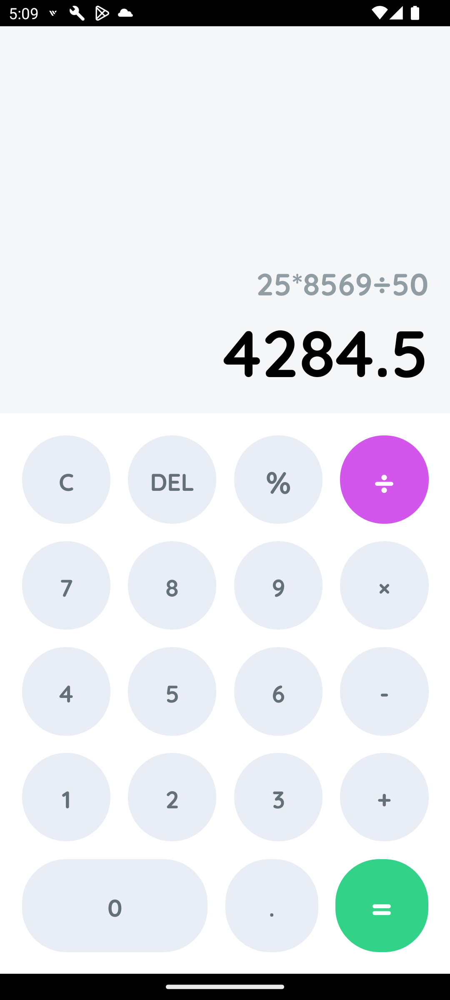
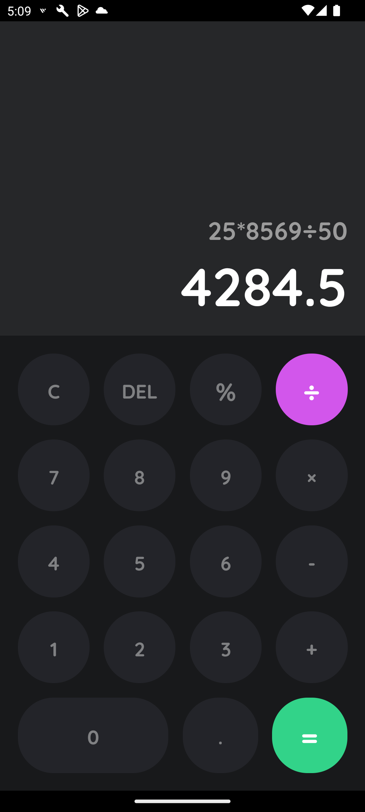

# React Native Calculator App

This project is a simple and functional calculator application built with React Native. It offers basic arithmetic operations and provides a native user experience on both iOS and Android devices.

## Features

Perform basic arithmetic operations:

- Addition (+)
- Subtraction (-)
- Multiplication (\*)
- Division (/)
- Clear (C)
- Percentage (%)
- Light and Dark modes!

User-friendly interface with clear buttons and a well-defined display

## Getting Started

Now that you have successfully run the app, let's modify it.

### 1. Prerequisites:

- Node.js and npm (or yarn) installed on your system (https://nodejs.org/en/download)
- Basic understanding of React Native concepts (https://reactnative.dev/docs/getting-started)

### 2. Clone the Repository:

```bash
git clone https://github.com/BashirMohamedAli/calculator_App.git
```

### 3. Install Dependencies:
   Navigate to the project directory and install dependencies:

```bash
cd calculator_App
npm install
```
### 4. Run the App:
### iOS:
```bash
# using npm
npm run ios

# OR using Yarn
yarn ios
```
### Android:
```bash
# using npm
npm run android

# OR using Yarn
yarn android
```
## Contributing
Yes please! Feature requests / pull requests are welcome.


## Screenshots

|             Light Mode              |             Dark Mode              |
| :---------------------------------: | :--------------------------------: |
|  |  |
